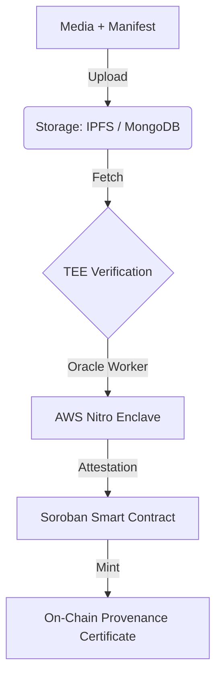

# ⭐ StellarProof — The Truth Engine for the Stellar Ecosystem

StellarProof is a decentralized digital content verification and provenance platform built on the Stellar blockchain. It enables creators, developers, and platforms to generate immutable authenticity proofs for digital media directly on-chain using **Soroban smart contracts** (Stellar's native smart contract platform built on Rust/WASM).

StellarProof provides **Proof-as-a-Service APIs**, allowing any application to verify content origin, integrity, and authenticity using a hybrid **Web2 + Web3 verification pipeline**.

---

## 🔑 Quick Summary

| Property                      | Value                                              |
| :---------------------------- | :------------------------------------------------- |
| **Project Name**              | StellarProof                                       |
| **Goal**                      | Provide verifiable, auditable provenance for digital media and metadata |
| **Blockchain**                | Stellar Network                                    |
| **Smart Contracts**           | Soroban (Rust)                                     |
| **Frontend + Business Logic** | Next.js + TypeScript + Tailwind CSS                |
| **Storage Layer**             | IPFS (Decentralized) or MongoDB (High Performance) |
| **Encryption Layer**          | StellarProof Key Management Service (KMS)          |
| **Trusted Verification Layer**| Oracle-driven TEE using AWS Nitro Enclave          |
| **Monorepo Manager**          | pnpm                                               |

---

## 🌐 What StellarProof Solves

Digital media today can easily be manipulated, forged, or misrepresented (e.g., Deepfakes, AI-generated content). StellarProof provides a robust solution through:

*   **✅ Tamper-proof content provenance**: Ensures the history and origin of content are recorded immutably.
*   **✅ Cryptographic authenticity verification**: Uses advanced cryptographic techniques to verify that media has not been altered.
*   **✅ On-chain certification of digital media**: Mints a permanent record on the Stellar blockchain that serves as a "digital birth certificate" for the asset.
*   **✅ Trustless verification for third-party apps**: Allows external applications to verify media without relying on a central authority.
*   **✅ Secure encryption and access control**: Protects sensitive media content while allowing controlled sharing.
*   **✅ Developer APIs for integration**: Simplifies the integration of trust verification into existing workflows.

---

## 🚀 Core Architecture

StellarProof combines **Web2 infrastructure** (for speed and storage) with **Web3 trust guarantees** (for immutability and verification).



## ⚙️ Key Features

### 📂 Media Provenance Verification
*   **Upload**: Supports images, videos, documents, or AI-generated media.
*   **Manifest**: Attaches a JSON manifest describing origin metadata (creator, timestamp, device info).
*   **Certification**: Generates immutable authenticity certificates on Stellar.

### 🔐 Encryption & Access Control (KMS)
StellarProof provides a comprehensive Key Management Service that:
*   **Encrypts media** before it enters the storage layer, ensuring privacy.
*   **Controls decryption permissions**, allowing creators to specify who can view the content.
*   **Enables creator-controlled content access** via dynamic policies.
*   **Supports key rotation and audit trails** for enterprise-grade security.

### 🧠 Trusted Off-Chain Verification (TEE Oracle)
StellarProof leverages **Trusted Execution Environments (TEEs)** to bridge off-chain data with on-chain trust.
*   **AWS Nitro Enclaves**: Provides a highly isolated compute environment to protect verification code and data from external tampering.
*   **Oracle Worker Nodes**: Orchestrate the flow of data between storage and the TEE.
*   **Cryptographic Attestation**: The TEE generates a signed proof that the verification code ran correctly and produced specific results.
    *   Verifies media integrity against the manifest.
    *   Verifies manifest authenticity.
    *   Generates signed attestation hashes for the blockchain.

### 📜 On-Chain Provenance Certificates
Soroban contracts mint immutable certificates containing:
*   **Storage reference IDs**: Links to the off-chain media (IPFS CID or Database ID).
*   **Manifest hash**: Ensures the metadata hasn't been altered.
*   **Attestation proof hash**: Links to the TEE verification result.
*   **Timestamp & Creator Identity**: Proves when and by whom the content was created.

### 🧪 Proof-as-a-Service APIs
Developers can easily integrate StellarProof:
*   **Submit verification jobs**: `POST /api/verify/submit`
*   **Query certificate status**: `GET /api/verify/status/:jobId`
*   **Receive webhook notifications**: Real-time updates on verification progress.

---

## 🏗️ Project Structure

```text
StellarProof/
├── README.md
├── pnpm-workspace.yaml
├── package.json
├── .env.example
│
├── apps/
│   ├── frontend/              # Next.js frontend + API routes
│   │   ├── app/
│   │   │   ├── api/
│   │   │   │   └── health/
│   │   │   │       └── route.ts
│   │   │   ├── layout.tsx
│   │   │   ├── page.tsx
│   │   │   └── creator/
│   │   │       └── upload-content/
│   │   │           └── page.tsx
│   │   ├── components/
│   │   └── styles/
│   │
│   └── oracle-worker/         # TEE orchestration worker
│       ├── src/
│       │   ├── teeExecutor.ts
│       │   ├── attestationService.ts
│       │   └── verificationPipeline.ts
│
├── services/
│   ├── storage/               # IPFS / MongoDB management
│   ├── kms/                   # Encryption & key management
│   ├── stellar/               # Stellar SDK integration
│   └── verification/          # Verification orchestration
│
├── contracts/
│   ├── oracle/                # Verification request contract
│   ├── provenance/            # Certificate minting contract
│   └── registry/              # Trusted TEE registry
│
├── packages/
│   ├── ui/
│   └── shared/
│       ├── types/
│       └── utils/
│
└── scripts/
    ├── deploy.sh
    └── testnet-config.sh
```

---

## 🧭 How StellarProof Works

### 👤 Creator Workflow

1.  **Manifest Creation**: Creators prepare a JSON manifest containing content hash, timestamp, creator metadata, and optional device/AI info.
2.  **Upload Media & Manifest**: Uploaded via `/creator/upload-content`.
3.  **Optional Encryption**: Media is encrypted using StellarProof KMS, generating encryption metadata and access policies.
4.  **Storage Layer**: Files are stored on **IPFS** (for decentralization) or **MongoDB** (for speed). A storage reference ID is returned.
5.  **Verification Request**: The creator submits a request to the Soroban smart contract.
6.  **TEE Oracle Verification**:
    *   The Oracle Worker fetches files.
    *   Executes verification inside the **AWS Nitro Enclave**.
    *   Produces an attestation report and verification hash.
7.  **On-Chain Certification**: Soroban contract verifies the attestation and mints a **Provenance Certificate**.

### 👨‍💻 Developer / Integrator Workflow

*   **POST** `/api/verify/submit`: Submit a new media file for verification.
*   **GET** `/api/verify/status/:jobId`: Check the status of the verification process.
*   **POST** `/api/webhook`: Receive a callback when verification is complete.

### 🧾 Manifest-First Verification Design

Each verification uses a flexible JSON manifest to enable unlimited use cases without backend modification:

```json
{
  "contentHash": "sha256:...",
  "creator": "G...",
  "timestamp": "2023-10-27T10:00:00Z",
  "metadata": {
    "device": "Camera Model X",
    "location": "Lat/Long",
    "aiModel": "None"
  }
}
```

---

## 🔗 On-Chain vs Off-Chain Responsibilities

### ⛓️ On-Chain (Soroban)
*   **Store verification requests**: Acts as the immutable log of requests.
*   **Validate TEE attestation signatures**: Ensures the proof comes from a trusted enclave.
*   **Store trusted TEE code hashes**: Governance mechanism to approve valid TEE versions.
*   **Mint provenance certificates**: Creates the final digital asset.

### 🌐 Off-Chain
*   **File storage**: Handles large media files (expensive on-chain).
*   **Encryption management**: Securely manages keys (KMS).
*   **TEE execution**: Performs heavy computation for verification.
*   **Oracle orchestration**: Coordinates the workflow.

---

## 🛠️ Smart Contracts Overview

1.  **📜 Verification Oracle Contract**: Handles verification request submission, attestation verification, and request state management.
2.  **🏆 Provenance Certificate Contract**: Stores storage IDs, attestation hashes, creator identity, and timestamps.
3.  **🧾 TEE Registry Contract**: Maintains a registry of approved TEE code hashes and trusted Oracle providers.

### 🔐 TEE Attestation Model
Each attestation includes:
*   **TEE signature**: Cryptographic proof of origin.
*   **Code measurement hash**: Proof that the correct code ran.
*   **Input storage hashes**: Proof of what data was processed.
*   **Verification output hash**: The result of the verification.
*   **Execution timestamp**: When it happened.

---

## 🧪 Storage Options

| Storage     | Purpose                             | Details                                                                          |
| :---------- | :---------------------------------- | :------------------------------------------------------------------------------- |
| **IPFS**    | Decentralized permanent storage     | Ensures content is available globally and uncensorable. Ideal for public proofs. |
| **MongoDB** | Fast metadata queries & MVP storage | Provides low-latency access and easier management for private or enterprise use cases. |

---

## 🧰 Tech Stack

| Component           | Technology                          |
| :------------------ | :---------------------------------- |
| **Blockchain**      | Stellar Network                     |
| **Smart Contracts** | Soroban (Rust)                      |
| **Frontend**        | Next.js + TypeScript + Tailwind CSS |
| **Storage**         | IPFS / MongoDB                      |
| **Encryption**      | Custom KMS                          |
| **Trusted Compute** | AWS Nitro Enclave                   |
| **Oracle**          | Node.js Worker                      |
| **Package Manager** | pnpm                                |

---

## ⚡ Getting Started

### Prerequisites
*   Node.js 18+
*   Rust (latest stable)
*   Soroban CLI
*   pnpm
*   Stellar wallet (Freighter recommended)

### Installation

1.  **Clone Repository**
    ```bash
    git clone https://github.com/yourusername/StellarProof.git
    cd StellarProof
    pnpm install
    ```

2.  **Run Frontend**
    ```bash
    cd apps/web
    pnpm dev
    ```

3.  **Run Oracle Worker**
    ```bash
    cd apps/oracle-worker
    pnpm dev
    ```

4.  **Compile Smart Contracts**
    ```bash
    cd contracts
    cargo build --target wasm32-unknown-unknown --release
    ```

### 🧪 Testing

*   **Unit Tests**:
    ```bash
    cargo test
    ```

*   **Integration Testing**:
    ```bash
    soroban network start
    ./scripts/deploy.sh
    ```

### 🚀 Deployment

*   **Testnet**:
    ```bash
    soroban contract deploy \
      --wasm target/wasm32-unknown-unknown/release/contract.wasm \
      --network testnet
    ```

*   **Mainnet**:
    ```bash
    soroban contract deploy \
      --network mainnet
    ```

---

## 🌍 Use Cases

*   **Journalism Authenticity**: Verify source and time of news footage.
*   **AI-Generated Content Verification**: Distinguish between human and AI creation.
*   **NFT Provenance**: Link NFTs to verifiable off-chain assets.
*   **Document Compliance**: Ensure legal or regulatory documents haven't been tampered with.
*   **Legal Audit Trails**: Create immutable chains of custody for evidence.
*   **Media Authenticity Platforms**: Power social media fact-checking.
*   **Supply Chain Media Verification**: Verify photos of goods at different transit points.

---

## 🗺️ Roadmap

*   **Phase 0 — Architecture Design**: Manifest schema, storage abstraction, Soroban contract schema.
*   **Phase 1 — MVP Creator Workflow**: Upload UI, Storage integration, Verification Oracle contract, Basic TEE simulation.
*   **Phase 2 — Developer APIs**: SDK release, Webhooks, Job management.
*   **Phase 3 — Security Hardening**: Full Nitro Enclave deployment, KMS key rotation, Monitoring dashboard.
*   **Phase 4 — Ecosystem Integration**: NFT provenance linking, Marketplace verification APIs, Cross-platform SDKs.
*   **Phase 5 — Governance & Registry**: TEE hash governance, Oracle provider staking.

---

## 🤝 Contributing

We welcome contributions!
1.  Fork the repository.
2.  Create a feature branch (`git checkout -b feature/amazing-feature`).
3.  Commit your changes (`git commit -m 'Add some amazing feature'`).
4.  Push to the branch (`git push origin feature/amazing-feature`).
5.  Open a Pull Request.

---

## 📄 License

MIT License

---

## 🙏 Acknowledgments

*   Built on **Stellar Blockchain**
*   Powered by **Soroban Smart Contracts**
*   Inspired by decentralized authenticity infrastructure

---

## ❤️ Vision

**StellarProof** aims to become the universal authenticity layer for digital content across the Stellar ecosystem, enabling trust, transparency, and verifiable digital truth.
